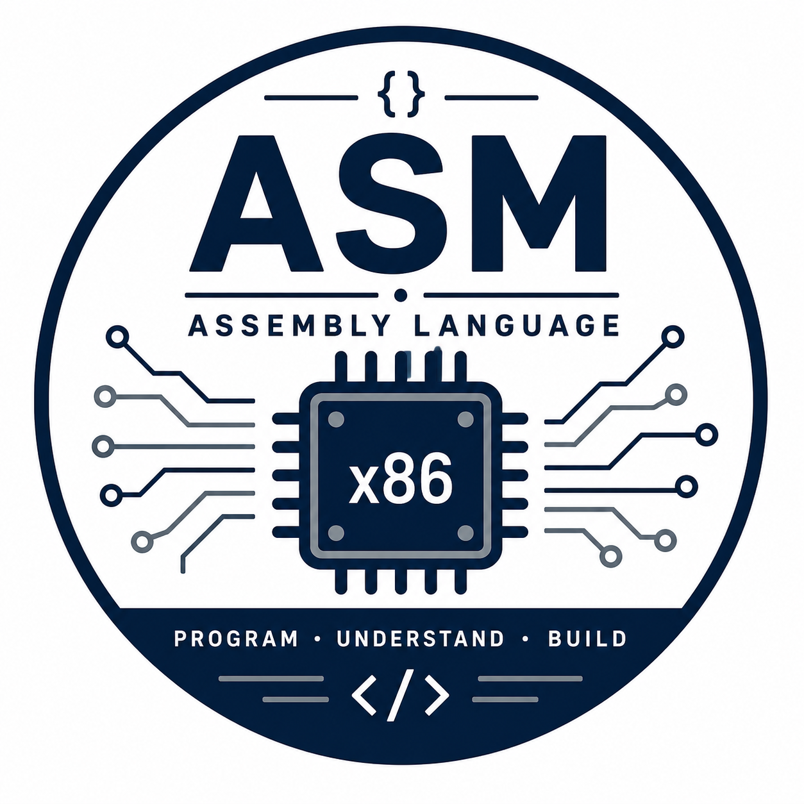

---
hide:
  - toc
---

    <a href="nrp/" class="resource-card">

        

            
        

        

            Cloud Lab Environment
        

        

                Cloud computing resources for learning, research, and AI.
        

    </a>

    <!-- LINUX -->
    <a href="linux/" class="resource-card">

         

            
        

        

            Linux Essentials
        

        

            Linux basics, commands, and text editings.
        

    </a>

    <!-- ASSEMBLY -->
    <a href="assembly" class="resource-card">

        

            
        

        

            Assembly Language
        

        

            Your hub for assembly language resources.
        

    </a>

