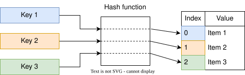
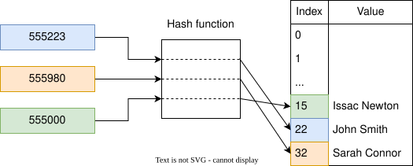
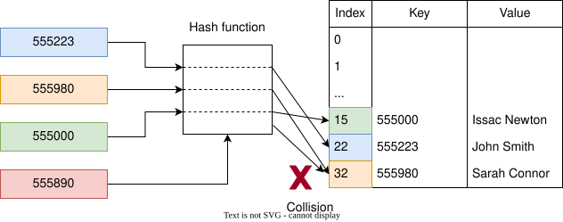
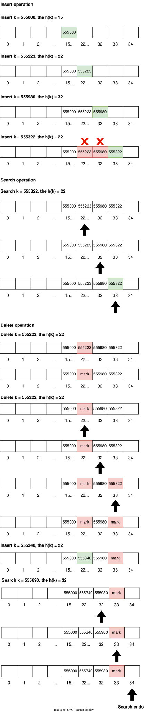

# Hash Tables

As discussed in previous weeks, under the worst-case scenario, linear search in an unordered array has an efficiency
of $O(N)$, whereas binary search in an ordered array has an efficiency of $O(\log N)$. For example, a linear search in
an unordered array of 1000 elements would take 1000 steps, and binary search in an ordered array would take 10 steps.
Compared to linear search, binary search works 100 times faster; however, keeping arrays in order would be a demanding
job where random values are inserted frequently in an array[^note1].

This chapter will explore another data structure called **hash tables**, which can search data in just $O(1)$
time[^note2].

## What are Hash Tables?

Hash tables, also known as hash maps, dictionaries, or associative arrays, are dictionary-like data structures that
consist of key-value pairs. Given a key, you can store a value and, when needed, retrieve the value using its key. In
other words, a hash table is a list of paired values. The following table shows a two-column table where the first
column is the key and the second is the corresponding value.

| Record number | Patient name |
|---------------|--------------|
| 555223        | John Smith   |
| 555980        | Sarah Connor |
| 555000        | Issac Newton |

> **A hash function maps data or keys of arbitrary size to fixed-size values.**

The following is the implementation of a dictionary in Python and C++.

```python
# Python code
# Dictionary with keys and values of different data types
record_number = {
    555223: "John Smith",
    555980: "Sarah Connor",
    555000: "Albert Einstein"
}
```

```cpp
// C++ code
#include <iostream>
#include <map>
#include <string>
using namespace std;

int main()
{
    map<int, string> MedicalRecord;

    // Adding the elements
    MedicalRecord[555223] = "John Smith";
    MedicalRecord[555980] = "Sarah Connor";
    MedicalRecord[555000] = "Issac Newton";

    // Traversing through the map elements
    for (auto element : MedicalRecord)
    {
        cout << element.first << " " << element.second << endl;
    }

    return 0;
}
```

## What is hashing and hash functions?

Hashing is a process of transforming any given key or a string of characters into another value, called a hash value. A
hash function can calculate the hash value for a given key.



For simplicity, I will avoid complicated and mathematically driven hash functions.

Let's continue using the same example described above. The hash function calculates the hash of a key by adding each
number in the key. For example, the hash of the 555223 key will be $5+5+5+2+2+3=22$. Similarly, the hash of 555980 and
555000 will be 32 and 15, respectively. Each hashed value corresponds to the memory index where the value is stored.



When a user searches for a value against the key, the hash function calculates the hash of the key, and the resulting
hash code is the index of the memory where the value of the key is stored. In the context of Big O notation, a search
would take $O(1)$.

> **Finding any value within the hash table in a single step only works if we know the value's key. If we tried to find
a particular value without knowing its key, the outcome would be searching every key-value pair within the hash table,
which is $O(N)$.**

### Cryptographic and non-cryptographic functions

Readers interested in Information Security must have heard of various hash functions such as MD5, SHA1, SHA2, etc.
Cryptographic hash functions are a special class among hash functions that aim to provide certain security guarantees
that non-cryptographic hash functions do not. For example, when obtaining a device fingerprint, you should use a
cryptographic hash function to have more guarantees of its output uniqueness.

#### Properties of cryptographic hash functions

A cryptographic hash function must withstand all known types of cryptanalytic attacks. In theoretical cryptography, the
security level of a cryptographic hash function has been defined using the following properties:

- **Deterministic:** The same message always results in the same hash.
- **Pre-image resistance:** Given a hash value $h$, finding any message $m$ such that $h = hash(m)$ should be difficult.
  This concept is related to that of a one-way function[^note3]. Functions that lack this property are vulnerable to
  preimage attacks. For example, using the MD5 hash function, the hash code of the `"Students"` string is
  `aba064f896dc3eb1653c3b68b9548ef1`. Reversing the process by inputting the hash code to the hash function to reveal
  the string should not be feasible. The following command is compatible with UNIX-like operating systems.

```bash
echo -n "Students" | md5
```

- **Avalanche effect:** A small change to a message (even if one bit is flipped) should change the hash value
  significantly so that the new hash value appears uncorrelated with the old hash value. For example, changing the
  string `"Students"` to `"students"` gives `75d37c6cbf460947005c97e3f12906a9`. Remember that the input to the hash
  function is case-sensitive.
- **Collision resistant:** It should be difficult to find two different messages, $m_1$ and $m_2$, such
  that $hash(m_1) = hash(m_2)$. Such a pair is called a cryptographic hash collision.

> **Suppose an attacker can control the keys that are used in your dictionary. In that case, they might be able to
insert hundreds or thousands of colliding keys, making insert operations very slow. In some cases, this could cause a
machine to become unresponsive or a database to become unusable—a denial-of-service attack.**

> **Hashing is not encryption. A hash function is a one-way function. Encryption, on the other hand, is a two-way
function.**

On the other hand, non-cryptographic hash functions provide weaker guarantees in exchange for performance improvements.

## Collision resolution

A hash function maps each key to a table index, but different keys can sometimes produce the same index. This is called
a **hash collision**. Using the same example, if the new key 555890 is added, the hash function may generate a hash code
that points to a memory index that already contains data.



Collisions are dealt with using two techniques: **open addressing (also called closed hashing)** and **closed
addressing (also called open hashing)**. Open addressing is a method of collision resolution in hash tables. With this
method, a hash collision is resolved by probing or searching through alternative locations in the array (the probe
sequence) until either the target record is found or an unused array slot is found, which indicates that there is no
such key in the table. Several techniques are based on open addressing, such as Linear Probing, Quadratic Probing,
Double Hashing, and Cuckoo Hashing.

> **Open addressing (closed hashing) and closed addressing (open hashing) terms can be confusing.**

Open hashing is a collision resolution method that uses an array of linked lists to resolve collisions. It is also known
as the **separate chaining** method because each linked list is considered a chain.

> **The difference between the two schemes is whether collisions are stored outside the table (closed addressing) or
whether collisions result in storing one of the records at another slot in the table (open addressing).**

### Linear probing (Open Addressing)

Linear probing is an example of open addressing and is one of the strategies used for resolving collisions in hash
tables. When the hash function causes a collision by mapping a new key to a cell of the hash table already occupied by
another key, linear probing searches the table for the closest following free location and inserts the new key. Lookups
are performed similarly by searching the table sequentially, starting at the position given by the hash function, until
finding a cell with a matching key or an empty cell.

#### Search

To search for a given key $k$, the cells of memory are examined, beginning with the cell at index $h(k)$ (where $h$ is
the hash function) and continuing to the adjacent cells $h(k)+1$, $h(k)+2$, and so on, until finding either an empty
cell or a cell whose stored key is $k$. If a cell containing the key is found, the search returns the value from that
cell. Otherwise, if an empty cell is found, the key cannot be in the table because it would have been placed in that
cell in preference to any later cell that has not been searched.

#### Insertion

To insert a key-value pair $(k,v)$ into the table, possibly replacing an existing pair with the same key, the insertion
algorithm follows the same sequence of cells that would be followed for a search until finding either an empty cell or a
cell whose stored key is $k$. The new key-value pair is then placed into that cell. When the hash function causes a
collision by mapping a new key to a cell already occupied by another key, linear probing searches the table for the
closest following free location and inserts the new key.

#### Deletion

It is also possible to remove a key-value pair from the dictionary. However, deletion cannot simply mark the cell as
empty. If the deletion process marks the cell empty, a search operation may stop when it reaches that empty cell and
fail to find a key located later in the probe sequence.

This problem can be solved by placing a special marker in place of the deleted cell, called a **tombstone**. The
tombstone indicates that a cell was once occupied by a key but is no longer occupied. A tombstone can later be reused to
store a new key. However, the insertion operation must still follow the search process to verify that there is no
duplicate key in the table.

After a series of intermixed insertion and deletion operations, some slots will contain tombstones. This tends to
lengthen the average distance from a record's home position to the record itself. One way of solving this problem is to
periodically rehash the table by reinserting all records into a new hash table. This removes the tombstones and can
place records closer to their home positions.

> **A record's or key's home position is the original position calculated by the hashing algorithm. The actual key
position may be at the original position or at the first available cell found during probing.**



## Hash table efficiency

The efficiency of a hash table depends on several factors:

**Type of hash function:** Suppose you have a hash function that generates only a limited number of hash values. Even
though you have available memory space, those limited hash values will use only a specific section of memory. As a
result, collisions become more likely. A good hash function distributes its data across all available memory cells. The
more evenly we spread our data, the fewer collisions we will have.

**Size of data in the hash table and available memory in the hash table:** A hash table's efficiency generally increases
when the number of collisions decreases. However, reserving many cells to store only a small amount of data is
inefficient in terms of memory usage. A good hash table balances collision reduction and memory consumption.

The ratio of the number of stored elements to the number of available cells is called the **load factor**:

$$
\text{Load factor} = \frac{\text{number of stored elements}}{\text{number of table slots}}
$$

For example, storing 7 elements in a table with 10 slots gives a load factor of 0.7. In general, a higher load factor
increases the likelihood of collisions and can make retrieval slower. With open addressing, the load factor cannot
exceed 1.

> **Hashing is an example of a space-time tradeoff[^note4]. If memory were unlimited, the entire key could be used
directly as an index to locate its value with a single memory access. On the other hand, if time were unlimited, values
could be stored without regard for their keys, and a binary or linear search could be used to retrieve an element.**

## Limitations and applications of hashing

- Hashing is not ideal for applications where multiple records with the same key value must be stored unless the
  implementation explicitly supports multiple values per key.
- Hashing is not a suitable method for answering range searches. In other words, we cannot easily find all records whose
  key values fall within a specific range.
- Hash tables do not naturally support quickly finding the minimum or maximum key or visiting records in sorted key
  order.
- Hashing is an excellent choice, when implemented correctly, for exact-match queries.
- Hashing is suitable for both in-memory and disk-based searching and is widely used for organizing and accessing data.

> **The average-case time complexity of hash-table search, insertion, and deletion is $O(1)$; however, in the worst
case, the time complexity can be $O(N)$.**

## Conclusion

Hash tables, when implemented correctly, can deliver average-case $O(1)$ performance for search, insertion, and
deletion. Hash tables are especially useful when data is organized as key-value pairs. Collisions can be resolved using
techniques such as open addressing and separate chaining. In this chapter, we focused primarily on linear probing, an
open-addressing technique.

[^note1]: A sorting algorithm is needed when random values are inserted into the array. A special case where sorting
would not be needed is when values are generated sequentially and added at the end of the array.

[^note2]: The average time complexity of a hash table is $O(1)$. However, if the hash function has weaknesses that lead
to many hash collisions, the time complexity can degrade to $O(N)$. This is discussed further in the chapter.

[^note3]: In computer science, a one-way hash function is designed so that it is computationally difficult to reverse
the process—that is, to find a string that hashes to a given value.

[^note4]: A space-time tradeoff, also known as a time-memory tradeoff, occurs when an algorithm trades increased storage
usage for decreased execution time, or vice versa. Here, space refers to the storage consumed in performing a task, and
time refers to the computation or response time.
