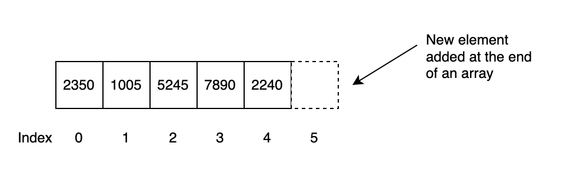
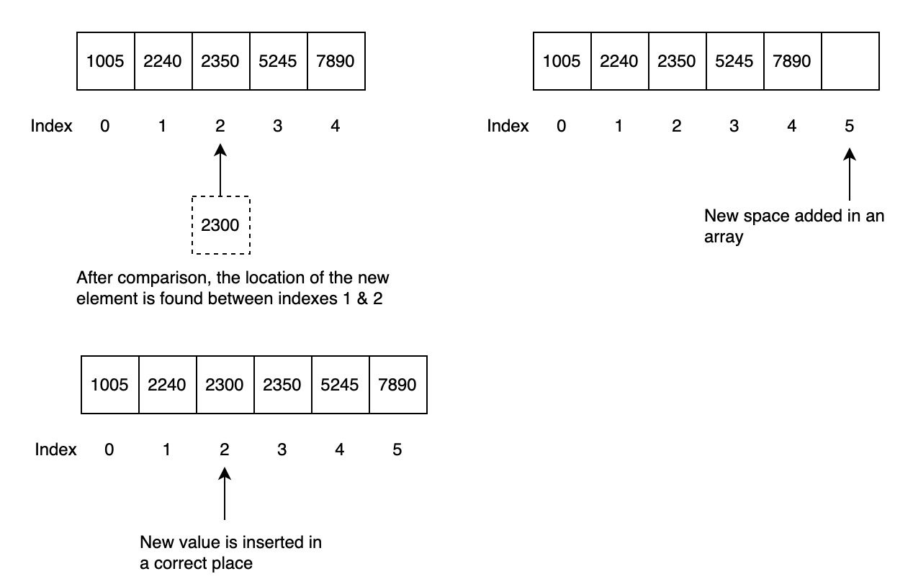
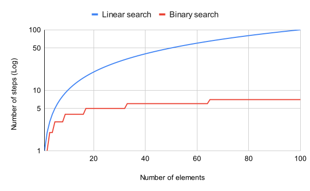
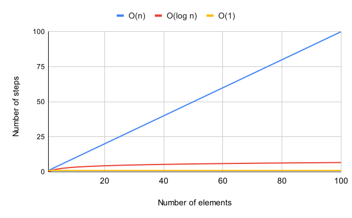

# Searching Algorithms and Big O Notations

As we discussed before that several versions of code might exist to achieve a task. However, some versions may be more efficient than others. One way to measure code efficiency is to calculate the number of steps required to achieve a desired result.

We also explored how the efficiency of a data structure varies depending on the operation being performed, such as reading, searching, insertion, and deletion. In this chapter, we dive deeper and discuss other factors that can affect code performance.

## Organization of Data

Let's extend our discussion of arrays. Assume that an array contains unique integers stored in random order. For a simple real-world example, consider an array containing the last four digits of Social Security numbers.

For simplicity, assume that an array is the best data structure for storing these values. If a user searches for a particular value, the processor starts at index 0 and continues until the desired element is found. If the desired value is the last element—the worst-case scenario—the search traverses the entire array.

Therefore, searching for an element in the worst case requires **N** steps, where **N** is the number of elements in the array.

In contrast, inserting data at the end of an unsorted array can require only one step because no elements need to be shifted.



Now assume that the elements in the array are sorted. For example, if the value `5245` is searched for, a linear search can stop once it reaches a value greater than `5245`, because the target cannot appear later in the sorted array.

!!! info "Linear Search"

    Linear search examines elements one at a time while looking for the target value. In a sorted array, the search can stop when it reaches an element greater than the target.

The following is basic pseudocode for linear search:

```text
1. Set i to 0.
2. If L[i] = T, terminate successfully and return i.
3. Increase i by 1.
4. If i < n, go to step 2. Otherwise, terminate unsuccessfully.
```

> **Does linear search perform better on sorted arrays than on unsorted arrays?**

In the worst case, no. Linear search may still require **N** steps, where **N** is the number of elements in the array.

!!! info "Worst-Case Scenario"

    The worst-case scenario is the input or situation that causes an algorithm to require the greatest amount of work or resources.

Keeping an array sorted also introduces additional work. When inserting a new value, the program may need to compare the new value with existing elements and shift elements so that the new value can be placed in the correct position.



Linear search therefore does not gain a better worst-case complexity simply because an array is sorted. However, sorting makes it possible to use more efficient search algorithms, such as **binary search**.

## Binary Search

Binary search works on **sorted arrays**.

The algorithm begins by comparing the target value with the middle element of the array:

- If the target equals the middle element, the search is complete.
- If the target is smaller, the search continues in the lower half.
- If the target is larger, the search continues in the upper half.

Each comparison eliminates approximately half of the remaining elements.

### Procedure

Given a sorted array `A` containing `n` elements and a target value `T`:

1. Set `L` to `0` and `R` to `n - 1`.
2. If `L > R`, terminate the search as unsuccessful.
3. Set `m` to `floor((L + R) / 2)`.
4. If `A[m] < T`, set `L = m + 1` and repeat.
5. If `A[m] > T`, set `R = m - 1` and repeat.
6. If `A[m] = T`, return `m`.

!!! note "Floor Function"

    The floor function returns the greatest integer less than or equal to a given number. For example, `floor(3.7) = 3`.

### Pseudocode

```text
function binary_search(A, n, T)
    L := 0
    R := n - 1

    while L <= R
        m := floor((L + R) / 2)

        if A[m] < T
            L := m + 1
        else if A[m] > T
            R := m - 1
        else
            return m

    return unsuccessful
```

## Comparison of Linear and Binary Search

The difference between linear and binary search becomes significant as the amount of data increases.

In the worst case:

- **Linear search:** approximately **N** steps
- **Binary search:** approximately **log₂N** steps

For example, if an array contains 100 elements:

- Linear search may require **100 steps**.
- Binary search requires at most about **7 steps**.

If an array contains 1,000 elements, binary search requires at most about **10 steps**.



!!! note "Trade-Off"

    Sorted arrays allow fast searching with binary search, but maintaining sorted order can make insertion more expensive. If an application performs many insertions and relatively few searches, an unsorted structure may be more appropriate.

## Big O Notation

Algorithm efficiency is often described by how the amount of work grows as the input size increases.

**Big O notation** provides a concise and consistent way to describe this growth.

!!! info "Big O Notation"

    Big O notation classifies algorithms according to how their time or space requirements grow as the input size increases.

For example, linear search may require **N** steps in the worst case. Its time complexity is therefore:

**O(N)**

If an operation always requires approximately the same amount of work regardless of the amount of data, its complexity is:

**O(1)**

Binary search repeatedly divides the remaining search space in half, giving it a complexity of:

**O(log N)**

> **Big O describes how the amount of work grows as the size of the data increases.**



### O(1) Example

```python
data = ["apples", "oranges", "grapes", "pineapple"]

data.append("kiwi")
print(data[0])
```

Accessing an element at a known index is **O(1)**. Appending to a dynamic array such as a Python list is typically described as **amortized O(1)** because occasional resizing may be required.

### O(N) Example

```python
data = ["apples", "oranges", "grapes", "pineapple"]

for item in data:
    print(item)
```

The loop visits every element. If the list contains **N** elements, the loop executes **N** times.

Therefore, the time complexity is **O(N)**.

### O(log N) Example

Binary search is a common example of **O(log N)** complexity because each comparison eliminates approximately half of the remaining search space.

For example:

| Number of Elements (N) | Maximum Binary Search Steps |
|---:|---:|
| 8 | 3 |
| 16 | 4 |
| 32 | 5 |
| 100 | 7 |
| 1,000 | 10 |
| 1,000,000 | 20 |

## Complexity Comparison

| Complexity | Description | Example |
|---|---|---|
| **O(1)** | Work remains approximately constant as input grows | Array access by index |
| **O(log N)** | Work grows slowly as input grows | Binary search |
| **O(N)** | Work grows proportionally with input size | Linear search |

## Conclusion

There is no single algorithm or data structure that is best for every situation.

Sorted arrays enable efficient searching using binary search, but maintaining sorted order can make insertion more expensive. Unsorted arrays can make insertion easier, but searching may require examining every element.

Big O notation helps programmers compare algorithms by describing how their computational requirements grow as the amount of data increases.
