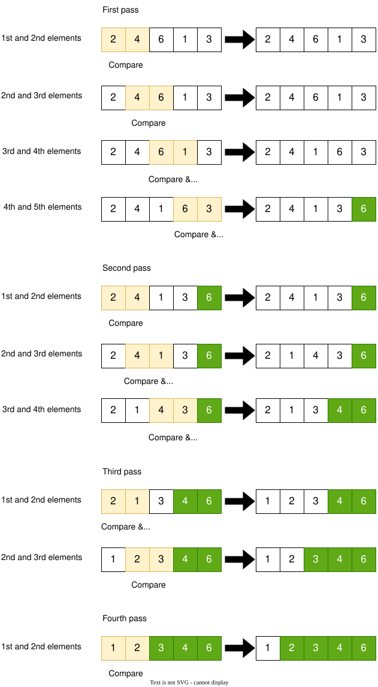
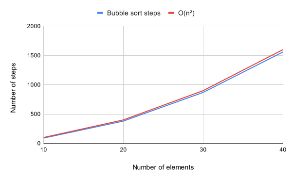
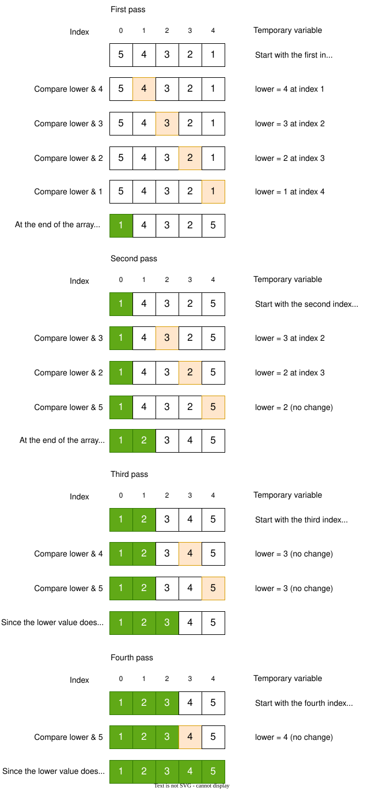
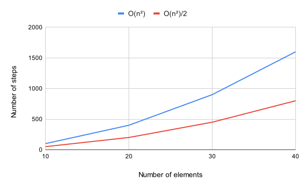
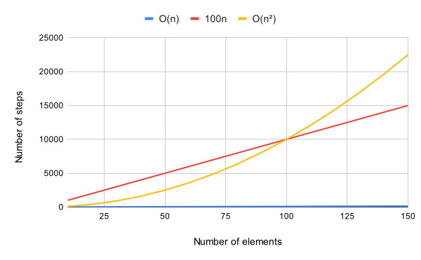
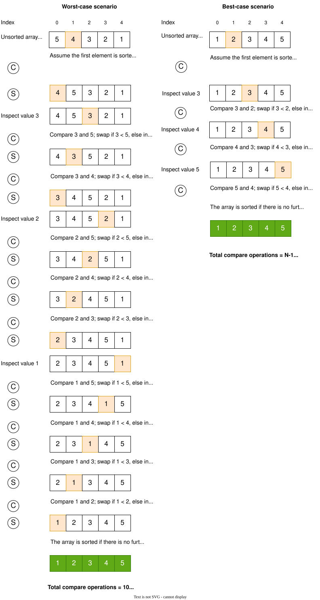

# Sorting algorithms

Previously, we noticed the importance of Big O notations for expressing the efficiency of an algorithm. With the help of
Big O notations, we managed to quantify the difference between linear and binary search algorithms.

In this chapter, we will extend our discussion of Big O notations, include some basic sorting algorithms, and explore
the efficiency of algorithms.

In computer science, a sorting algorithm is used to sort elements of a list in order. The most frequently used orders
are numerical and lexicographical. In __numerical order__, numbers are ordered in ascending or descending order. In _
_lexicographical order__, the letters are sorted from A-Z, an arrangement of characters, words, or numbers in
alphabetical order. This is also known as dictionary order because it is similar to searching for a particular word in
an actual dictionary.

As discussed in the previous chapter, the binary search algorithm works on a sorted array. Therefore, without a sorted
array, the binary search algorithm efficiency would not be $O(log N)$. In other words, sorting is an important step that
enables some algorithms to function efficiently.

## Real-world applications

- Sorting is used every day in our lives. For example, financial institutions sort the accounts by name, account number,
  or transaction date. Likewise, the mail is sorted by postal/zip code. It is generally easier to work with a sorted
  list versus an unsorted list.

- Suppose that we have $N$ jobs to complete, where job $j$ requires $t_j$ seconds of processing time. We need to
  complete all the jobs but want to maximize customer satisfaction by minimizing the average completion time. The
  shortest processing time first rule, where we schedule jobs in increasing order of processing time, is known to
  accomplish this goal.[^opsearch]

- Priority queues play a fundamental role in organizing graph searches, enabling efficient algorithms.

## Bubble sort

It is one of the simplest sorting algorithms almost every computer science student studies. The algorithm works by
repeatedly swapping the adjacent elements if they are in the wrong order. The {numref}`bubble_sort` shows the bubble
sort in action. The elements are compared in sequence and swapped if the order is incorrect in each pass. At the end of
each pass, the highest unsorted value goes to its correct position. As you see, at each pass, the single highest value
gets the right order at the end of the array. During each pass, if a single swap happens, the sorting algorithm
continues until no swap is performed. In this example, the fourth pass is the last/final pass, meaning there is no pass
after this, and the array is sorted. If you look carefully at each pass, the number of iterations decreases by one. For
example, there are four iterations at pass one, three at pass two, two at pass three, and one at pass four. Such
reduction in iterations is because at each pass, a single element gets the correct position, and there is no need to
compare the already sorted value, thus decrease in processing time and increasing the algorithm's efficiency.



The following is the pseudocode of the Bubble Sort algorithm.

```
procedure bubbleSort(A : list of sortable items)
    n := length(A)

    repeat
        swapped := false

        for i := 1 to n - 1 do
            if A[i - 1] > A[i] then
                swap(A[i - 1], A[i])
                swapped := true
            end if
        end for

        n := n - 1

    until not swapped
end procedure
```

### Efficiency of Bubble Sort

To quantify the efficiency of a bubble sort algorithm, I will discuss the worst-case scenario, where the array is sorted
in descending order, and the goal is to sort the array in ascending order. Lets assume the ```array=[5,4,3,2,1]```. The
algorithm performs two operations; compare and swap. There will be four comparisons in the given array at the first
pass. Similarly, at the second pass, there will be three comparisons. In order words, the number of comparisons
when $N=5$ is $(N-1)+(N-2)+(N-3)+...+1$, where $N$ is the length of an array, and $N\geq2$. The number of swaps in the
worst-case scenario is equal to the number of comparisons, which means that there is a swap operation at each
comparison. {numref}`bb_sort` summarizes the number of elements in an array and the corresponding steps. If you look at
the growth of steps as N increases, you will see that it is growing by approximately $N^2$.

| Number of elements | Bubble sort steps | $O(N^2)$ |
|-------------------:|------------------:|---------:|
|                 10 |                90 |      100 |
|                 20 |               380 |      400 |
|                 30 |               870 |      900 |
|                 40 |              1560 |     1600 |

The following figure visualizes the data. The graph shows that the $O(n^2)$ is a close
approximation to the Bubble Sort steps.



> __The Bubble Sort algorithm has a time complexity of $O(N^2)$, which is also referred to as quadratic time.__

## Selection sort

Let's explore another sorting algorithm, Selection Sort, and compare it with the Bubble Sort algorithm and find out
which algorithm performs well.

The following figure shows the working of the Selection sort algorithm. In this algorithm, the lower value
is identified at each pass and placed the lower value at the index 0 and onwards sequentially. For example, at the first
pass, the lower value is placed at the index 0; at the second pass, the lower value is placed at the index 1, and so on.
In every pass, there will be at least a comparison; however, a swap can take place either one time or none per pass. For
example, the third and fourth passes have no swap. Every pass performs comparison operations for $N-i$ times, where $N$
is the array's length, and $i$ is the run counter. Based on the given example, the first run (i=1) performs 4 compare
operations; the second run (i=2) performs three compare operations, and so on. See the next section for further
discussion.



### Efficiency of Selection Sort

Similar to the Bubble Sort algorithm, the number of comparisons when $N=5$ is $(N-1)+(N-2)+(N-3)+...+1$, where $N$ is
the length of an array, and $N\geq2$. However, there is either one or zero swap per pass, or in general, $N-1$ swaps.

{numref}`s_sort` summarizes the operation of compare and swap for both the Selection and Bubble sort algorithms. The
number of steps involved in the Selection sort to compare is $(N-1)+(N-2)+...+1$ where $N$ is the number of elements.
The number of steps involved in the swap operation in the Selection sort algorithm is $N-1$. However, as discussed in
the section {ref}`my-label`, the steps required to perform "swap operations" are the same as the "compare operations" in
the Bubble sort algorithm. Based on the above discussion and the data shown in {numref}`s_sort`, we can conclude that
the time complexity of Selection sort is about on average 1.8 of $N^2$, or $O(\frac{N^2}{1.8})$. For simplicity reasons,
the 1.8 is rounded up to 2. How 1.8 is calculated is explained in the footnote.[^ssort]

Bubble sort comparisons / selection sort of each $N$ where $N=[10,20,30,40]$ and take average.

The following table show the comparison of steps in Selection and Bubble Sort algorithms

|  N | Selection sort compare & swap operations | Bubble sort compare & swap operations |
|---:|-----------------------------------------:|--------------------------------------:|
| 10 |                                       54 |                                    90 |
| 20 |                                      209 |                                   380 |
| 30 |                                      464 |                                   870 |
| 40 |                                      819 |                                  1560 |

The time complexity of Selection Sort is approximately $O\left(\frac{N^2}{2}\right)$. From the graph,
Selection Sort appears to be more efficient than Bubble Sort because it performs fewer operations. However, from the
perspective of Big O notation, both algorithms have the same time complexity, $O(N^2)$. The reason for this is explained
below.



According to the rules of Big O notations, the notation ignores constants and numbers that are not an exponent. For
example, if you have a function running time of 5N, we say that this function runs on the order of the big O of N. This
is because the constant five no longer matters as N gets large. In our case, even though the algorithm
takes $\frac{N^2}{2}$ steps, we drop the "/ 2" because it’s a regular number and express the efficiency as $O(N^2)$.
Another example is if an algorithm takes 100N, it is still considered $O(N)$.

Big O notation only takes into account of higher degree polynomial. For example, if an algorithm steps follow a
quadratic equation, then the big O notation will be $O(N^2)$, ignoring lower degree polynomial. Similarly, if an
algorithm follows a cubic function $f(x) = ax^3+bx^2+cx+d$, the big O notation will be $O(N^3)$.

> __Why $O(N)$ and $O(N^2)$ are considered as two seperate categories?__  
> The Big O Notation does not care about the number of steps an algorithm takes. It cares about the long-term trajectory
> of the algorithm's steps as the data size increases. $O(N)$ tells the story of linear growth, whereas $O(N^2)$ tell
> the
> story of quadratic growth. Any constant multiplies or divides with the notation does not change the linear or higher
> order nature of the algorithm.

The following figure shows the relationship between the linear and the exponential growth of an algorithm.
The overall relationship is linear regardless of a multiplier, and under large N, the exponential underperforms than
linear.



> __The Selection Sort algorithm, similar to the Bubble sort, takes $N^2$ steps and has an efficiency of $O(N^2)$.__

## Insertion sort

As we learn more about sorting algorithms, you will notice that some sorting algorithms possess the same time complexity
under the worst-case scenario. Still, they may have different time complexity under the best or average case scenarios.
However, till now, I have mainly discussed the worst-case scenario. This is because, theoretically, if an algorithm
works well in a worst-case scenario, it is valid to say that it will perform better in any given scenario. Therefore,
this section will further discuss how the algorithm behaves under various scenarios.

### Insertion sort steps

The following are the steps involved in the insertion sort.

1. In insertion sort, the element at index $i$ is compared with the elements at index $i-1$, where the index cannot be a
   negative number and the index is less than $N$; where $N$ is the length of the array.
2. The sort begins by selecting an element for inspection. The first inspected element at index $i=1$ is compared with
   the element at $i-1$. If the $i^{th}$ element is less than $i-1$ element, then elements at index $i$ and $i-1$ are
   swapped, and $i^{th}$ index reset to $i-1$. If the $i^{th}$ element is greater than $i-1$ element, then no swap, and
   inspect another element at index $i+1$. The selection of inspected elements ends when $i=0$.
3. The array is sorted, and no additional element is inspected, $i=N$.

The figure shows worst and best-case scenarios. The compare and swap operations are represented in C and S
circles, respectively. Finally, the element is inspected based on the steps mentioned in {ref}`isteps`.



The following is the pseudocode of the Insertion sort algorithm.

```
i ← 1
while i < length(A) // where A is the array
    j ← i
    while j > 0 and A[j-1] > A[j]
        swap A[j] and A[j-1]
        j ← j - 1
    end while
    i ← i + 1
end while
```

### Efficiency of Insertion sort

The above figure shows that the total number of comparison and swap operations is 20 in the worst-case
scenarios. In contrast, there is no swap operation in the best-case scenario, because all elements are sorted,
but there are $N-1$ comparisons.

Comparison and swap operations under worst-case sceanrio uses $(N-1)+(N-2)+...+1$ where $N$ is the number of
elements.

The following table shows the time complexity of Insertion Sort algorithm under worst and best-case scenarios

| N  | Insertion sort compare & swap operations (worst-case) | Insertion sort compare & swap operations (best-case) |
|---:|------------------------------------------------------:|-----------------------------------------------------:|
| 10 | 90                                                    | 9                                                    |
| 20 | 380                                                   | 19                                                   |
| 30 | 870                                                   | 29                                                   |
| 40 | 1560                                                  | 39                                                   |


The above comparison table shows that the closest approximation to the worst-case scenario is $N^2$. However, under the
best-case scenario, the time complexity is $O(N)$ steps. Theoretically, under the average-case scenario, the time
complexity of the upper and lower bound would be between $O(N^2)$ and $O(N)$, respectively. I have done some random
tests to determine the time complexity under the average-case scenario, and it is turned out to be $O(N^2)$.

The selection sort time complexity is $O(N^2)$ for all three cases. The insertion sort performs well under the best-case
scenario compared to the selection sort. On the contrary, the time complexity of Bubble sort and Insertion sort
algorithms are the same in all three cases.

> __The time complexity of the Insertion Sort algorithm under the worst and average case scenarios are $O(N^2)$.
However, under the best-case scenario, the time complexity is $O(N)$.__

## Conclusion

Knowing how an algorithm behaves under different conditions is essential for a programmer. The performance of each
algorithm is also dependent upon the number of elements. Some algorithms are designed to handle a large number of
elements efficiently. It is a programmer's job to select the correct algorithm for the right job.
