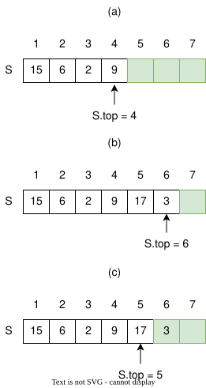
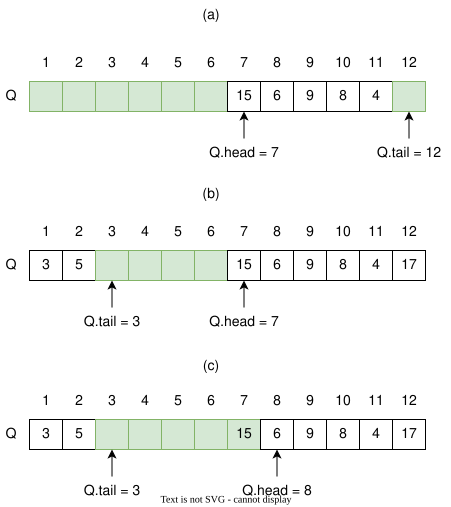

# Stacks and Queues

This section discusses two data structures: stacks and queues. Both are based on the array data structure, but unlike
conventional arrays, they impose restrictions on how elements are inserted, deleted, and accessed.

Stacks and queues are dynamic arrays in which the element removed from the array by the delete operation is
predetermined. In a stack, the element deleted from the array is the one most recently inserted. The stack implements a
last-in, first-out, or LIFO policy. Similarly, in a queue, the element deleted is always the one that has been in the
array for the longest time. The queue implements a first-in, first-out, or FIFO policy. There are several ways to
implement stacks and queues on a computer. This chapter will use a simple array to implement each.

## Stacks

Stacks are implemented using arrays; however, there are a few constraints:

- Elements are inserted only at the end of a stack, also called the push operation.
- Elements are deleted only from the end of a stack, also called the pop operation.
- Reading operations are executed from the end of a stack.

Think of a stack as a pile of plates, where adding and removing plates from the pile occurs at the top of the stack.

The insert operation on a stack is often called **PUSH**, and the delete operation, which does not take an element
argument, is often called **POP**.

Programming languages don't necessarily have stack data types, but stacks can be built using the array data type. A
stack is an example of an abstract data type.

> **_Abstract data type_ — a kind of data structure defined by a set of theoretical rules that can be implemented using
other built-in data structures.**

The following table shows the operations that can be performed on a stack.

| Operation    | Description                                                                                  |
|--------------|----------------------------------------------------------------------------------------------|
| `push()`     | Adds an element to the top of the stack                                                      |
| `pop()`      | Removes an element from the top of the stack                                                 |
| `peek()`     | Returns a copy of the element on the top of the stack without removing it                    |
| `is_empty()` | Checks whether a stack is empty                                                              |
| `is_full()`  | Checks whether a stack is at maximum capacity when stored in a static (fixed-size) structure |

The following figure shows that we can implement a stack of at most $n$ elements with an array $S[1..n]$. The array has
an attribute $S.top$ that indexes the most recently inserted element. The stack consists of $S[1..S.top]$, where $S[1]$
is the element at the bottom of the stack and $S[S.top]$ is the element at the top.

When $S.top=0$, the stack contains no elements and is __empty__. We can test whether the stack is empty using the
`STACK-EMPTY` operation or by calling an `is_empty()` function. If we attempt to pop an empty stack, we say the stack *
*underflows**. If $S.top$ exceeds $n$, the stack __overflows__.



The following is the pseudocode implementation of a stack, without stack overflow checking.

```text
STACK-EMPTY(S)
    if S.top == 0
        return TRUE
    else
        return FALSE
```

```text
PUSH(S, x)
    S.top = S.top + 1
    S[S.top] = x
```

```text
POP(S)
    if STACK-EMPTY(S)
        error "underflow"
    else
        S.top = S.top - 1
        return S[S.top + 1]
```

> **The three stack operations take $O(1)$ time.**

## Queues

In queues, we call the insert operation **enqueue** and the delete operation **dequeue**. Similar to the POP operation
in a stack, dequeue takes no element argument. The FIFO property of a queue causes it to operate like a line of
customers waiting to pay a cashier.

The queue has a **head** and a **tail**. When an element is enqueued, it takes its place at the tail of the queue, just
as a newly arriving customer takes a place at the end of the line. The element dequeued is always the one at the head of
the queue, like the customer at the head of the line who has waited the longest.

The following figure shows one way to implement a queue of at most $n-1$ elements using an array $Q[1..n]$. The queue has
an attribute $Q.head$ that indexes, or points to, its head. The attribute $Q.tail$ indexes the next location at which a
newly arriving element will be inserted into the queue.

The elements in the queue reside in locations $Q.head, Q.head+1, \ldots, Q.tail-1$, where we "wrap around" in the sense
that location 1 immediately follows location $n$ in a circular order. When $Q.head = Q.tail$, the queue is empty.
Initially, we have $Q.head = Q.tail = 1$.

If we attempt to dequeue an element from an empty queue, the queue **underflows**. When $Q.head = Q.tail + 1$, or
both $Q.head = 1$ and $Q.tail = Q.length$, the queue is full. If we attempt to enqueue an element into a full queue, the
queue **overflows**.



In our procedures `ENQUEUE` and `DEQUEUE`, we have omitted error checking for underflow and overflow. The pseudocode
assumes that $n = Q.length$.

```text
ENQUEUE(Q, x)
    Q[Q.tail] = x
    if Q.tail == Q.length
        Q.tail = 1
    else
        Q.tail = Q.tail + 1
```

```text
DEQUEUE(Q)
    x = Q[Q.head]
    if Q.head == Q.length
        Q.head = 1
    else
        Q.head = Q.head + 1
    return x
```

> **The two queue operations take $O(1)$ time.**

## Conclusion

Stacks are ideal for processing data in LIFO order. Applications of stacks, such as the "undo" function in a word
processor and checking errors such as missing parentheses in code, are a few examples.

Queues process requests based on FIFO order. Queue data structures are implemented in print servers and for handling
hardware or real-time system interrupts, among other applications. In this chapter, only basic queues are discussed.