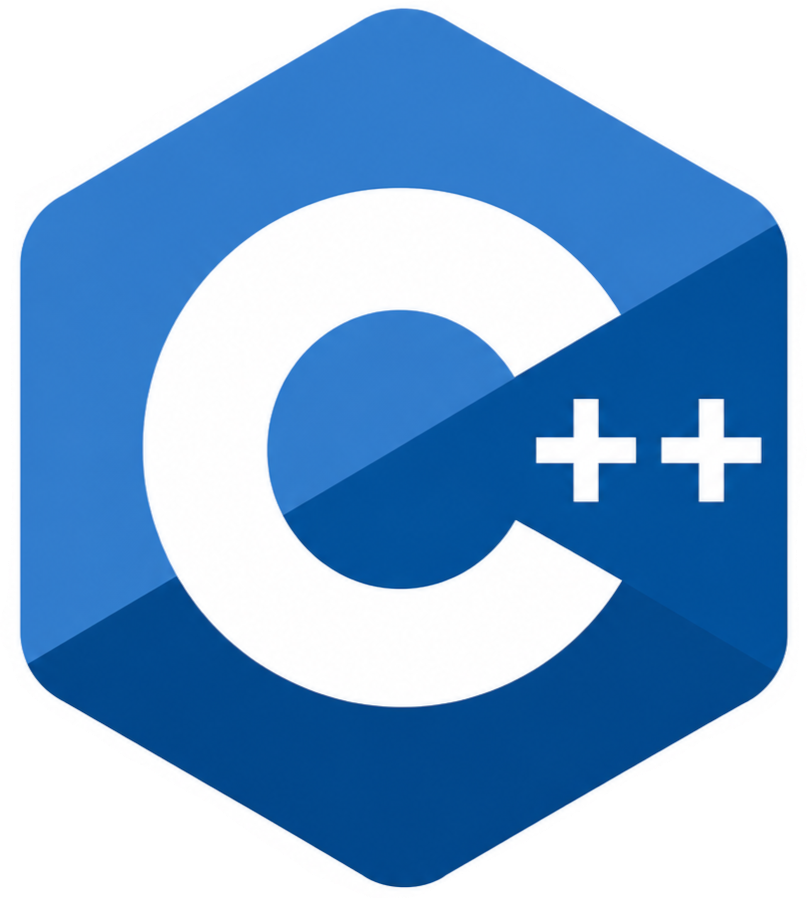
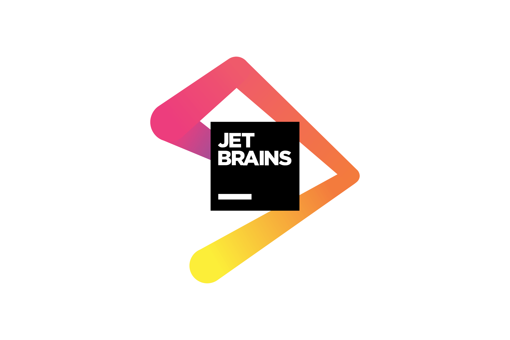

---
hide:
  - toc
---

    <a href="compiler/" class="resource-card">

        

            
        

        

            C++ compiler
        

        

                Installing C++ compiler.
        

    </a>

     <a href="cpp_contents/" class="resource-card">

        

            
        

        

            C++ content videos
        

        

                Watch C++ videos.
        

    </a>

    <!-- JetBrains -->
    <a href="ide/" class="resource-card">

         

            
        

        

            C++ IDE
        

        

            Set up CLion for C++ development.
        

    </a>

